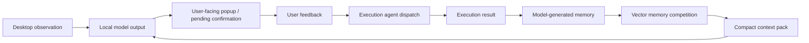
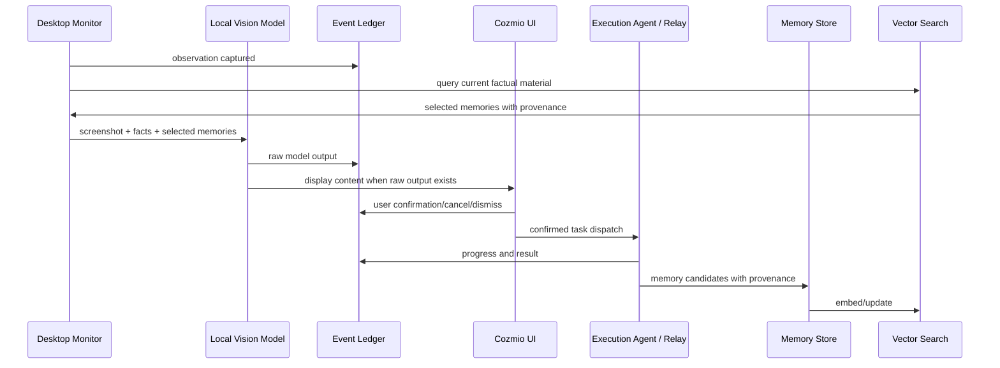

# Practice Loop V1 Design

> Status: draft for review  
> Date: 2026-04-29  
> Scope: next major product-effect stage for Cozmio

## 1. Purpose

Practice Loop V1 is the next major stage after semantic-boundary cleanup. Its goal is to make Cozmio visibly more useful in real daily work, and to move the project toward a product that can eventually be demonstrated, sold, and improved through use.

This stage should not be a small patch to popup text. It should build the loop that makes popup quality, execution usefulness, and memory quality improve together.

Cozmio should begin to answer these questions with evidence:

- What did Cozmio observe today?
- What did the local model produce?
- Which outputs became popups or pending confirmations?
- What did the user confirm, cancel, dismiss, or ignore?
- What did execution agents actually do?
- What result came back?
- What memory was produced from the day or task?
- Which memories were later selected into context?
- Did the next model output become more grounded, timely, and useful?

The business value is not “Cozmio can pop up”. The business value is “Cozmio becomes a desktop work companion that learns from the user’s own workflow and can connect observation, execution, and memory into a compounding loop.”

## 2. Product Thesis

The product should evolve from an observation assistant into a self-improving work loop:



The loop must be practical, not theatrical. Every part should leave a trace that can be inspected, evaluated, and reused.

## 3. Non-Negotiable Philosophy

### 3.1 Model Owns Semantics

The system provides facts, tools, routing, storage, and provenance. The system does not author semantic conclusions.

Allowed system facts:

- timestamp
- trace id
- session id
- foreground window title
- process name
- screenshot reference
- raw local model output
- raw execution output
- raw error text
- user UI event
- file path
- source range
- record id
- duration/count
- embedding vector
- retrieval score
- selected memory id

Forbidden system-authored semantics:

- user intent
- project phase
- task phase
- whether the user is stuck
- whether a popup is useful
- whether the model should be silent
- whether the current screen is important
- whether this is a project-iteration opportunity

If a semantic sentence exists, it must come from one of:

- local model output
- execution agent output
- user-written text
- imported conversation/log content written by a model or human

And it must keep provenance.

### 3.2 Do Not Mechanically Control Popup Behavior

Practice Loop V1 must not solve popup quality by adding mechanical suppression.

Do not add:

- popup cooldown
- frequency cap
- structured silence policy
- `should_popup`
- `should_silence`
- system-authored popup usefulness labels
- hard field that forces the model into a tiny decision schema

Popup frequency and content remain model-led. Cozmio improves the material around the model, not by tying the model down.

**Display-layer protection is not suppression.** The system may use presentation-layer protections that guard the user interface without making semantic judgments about whether the model should have spoken. Examples:

- All model outputs enter the Event Ledger regardless of display state.
- The UI may place multiple pending items into a queue or inbox rather than showing all simultaneously.
- Only the current/active pending item is shown; others are retained in the queue.
- Users can expand the queue to see all pending items.
- The system records `displayed_at`, `queued_at`, `user_seen_at` as factual timestamps.

This means: the model may continue outputting; the system does not erase it. The UI is not required to surface every output simultaneously. The model remains in full control of when it produces output.

### 3.3 Context Pack Is A Fact Harness

The context pack should not explain the world to the model. It should provide compact, sourced materials that the model can interpret.

Good context pack material:

- “Recent event id=..., timestamp=..., window=..., raw_model_text=...”
- “Execution result id=..., session=..., result_text=..., error_text=...”
- “Memory id=..., producer=execution-agent, source=..., text=...”
- “Retrieval score=..., reason not included unless model-authored”

Bad context pack material:

- “The user is currently iterating Cozmio.”
- “The user is in debugging phase.”
- “This is likely a good time to interrupt.”
- “User seems stuck.”

## 4. Stage Goal

Practice Loop V1 should produce a real measurable improvement in Cozmio’s daily usefulness:

1. The system captures enough factual traces to reconstruct what happened.
2. Execution results return to Cozmio reliably.
3. Model or execution-agent memories are generated from real traces.
4. Vector retrieval selects a small number of relevant memories.
5. The local model receives better compact context without exceeding its small context window.
6. The UI shows the loop clearly enough that the user can tell whether Cozmio is improving.

## 5. System Shape

Practice Loop V1 has five main modules:

1. Event Ledger
2. Execution Return Channel
3. Memory Distillation
4. Vector Memory Competition
5. Practice Loop Dashboard

These modules should be designed as a foundation, not a narrow one-off feature.

## 6. Module 1: Event Ledger

### Purpose

Create a reliable factual ledger of what Cozmio observed, produced, routed, and received.

This is the backbone of the loop. Without a ledger, memory becomes vague, execution results disappear, and popup quality cannot be evaluated.

### Records

The ledger should support event types such as:

- observation captured
- local model called
- local model output received
- popup displayed
- pending confirmation created
- user confirmed
- user cancelled
- user dismissed
- relay dispatched
- execution progress received
- execution result received
- execution error received
- memory generated
- memory selected into context
- context pack built

These are factual event names, not semantic judgments.

### Required Fields

Each event should include:

- `event_id`
- `trace_id`
- `session_id` when available
- `timestamp`
- `event_type`
- `source`
- `window_title` when available
- `process_name` when available
- `raw_text` when available
- `content_ref` when large text should be stored externally
- `parent_event_id` when derived from another event
- `metadata` for non-semantic facts

### Large Content

Large text should not always be copied into every record. Use content references for:

- screenshots
- long local model output
- relay output
- Claude Code transcript slices
- daily summary source material

### Content Ref Structure

A `content_ref` is not a bare path string. It must be a structured reference with minimum fields:

- `content_ref` — unique identifier for this content
- `content_type` — e.g. `screenshot`, `model_output`, `relay_output`, `transcript`
- `storage_backend` — e.g. `file`, `sqlite_blob`, `future_remote`
- `path_or_key` — resolver-specific address
- `byte_range` or `line_range` — optional slice reference
- `content_hash` — integrity check
- `created_at`
- `producer` — who/what produced this content

Execution agents do not parse bare paths directly. The system provides a content ref resolver that expands a `content_ref` into agent-readable material. The resolver handles backend differences so agents receive a consistent interface regardless of storage.

### Event Ledger Write Path

The Event Ledger uses a layered storage architecture:

1. **JSONL = canonical append-only event stream**
   - Every event is appended as one JSON line to `event-log/*.jsonl`.
   - This is the source of truth. It is append-only, can be replayed, and can be read directly by agents.
   - New fields can be added without migration; old records remain valid.

2. **SQLite = query projection / index**
   - Events are ingested from JSONL into a SQLite database for efficient querying.
   - SQLite serves the UI: timeline, trace lookup, filtering, stats, and dashboard.
   - If SQLite is lost or corrupted, it can be rebuilt by re-ingesting from JSONL.

3. **Content Store = large blob storage**
   - Screenshots, long outputs, and transcripts are stored separately.
   - JSONL events contain only the `content_ref`, not the full content.
   - Content Store path: `content-store/{year}/{month}/{content_ref}`

```
event-log/*.jsonl     ← canonical append-only event stream (source of truth)
content-store/*        ← screenshots, long outputs, transcripts
cozmio-ledger.sqlite  ← query projection / UI index (rebuildable from JSONL)
```

### Compatibility

Existing `ActionRecord` and UI state should continue to load old records, but new records should use factual event naming. The UI can display legacy fields for old data, but the new writer should not create new fake semantic records.

## 7. Module 2: Execution Return Channel

### Purpose

Make execution agents first-class participants in the loop.

Execution is not only “run a task”. Execution agents are stronger models and longer-context processors. They should help Cozmio digest work, summarize traces, and produce durable memories.

### Inputs

Execution return can come from:

- Relay session result
- Claude Code project transcripts
- Claude Code subagent logs
- OpenCode or future execution logs
- direct tool output
- user-confirmed task text

### Returned Artifacts

Execution agents may return:

- result text
- changed files
- test results
- failure reason
- follow-up suggestion
- memory candidate
- daily/phase summary
- source pointers

### Rule

Execution result text is stored as execution output. If it contains semantic interpretation, that is acceptable because the producer is a model/agent. The system must preserve the producer and source.

## 8. Module 3: Memory Distillation

### Purpose

Turn long traces into compact memories without asking the small local model to read everything.

The local model is context-limited. It should mostly observe and produce immediate output. Larger distillation work should be delegated to execution agents or scheduled background processors.

### Memory Types

Practice Loop V1 should allow several memory classes:

- daily work memory
- project memory
- execution memory
- user preference memory
- recurring workflow memory
- failed attempt memory
- confirmed useful output memory
- ignored/cancelled output memory

These are storage classes, not system conclusions. The actual memory text must be generated by a model/agent or explicitly written by the user.

### Memory Record

Each memory should include:

- `memory_id`
- `created_at`
- `producer`
- `source_event_ids`
- `source_paths`
- `source_ranges` or record ids
- `memory_text`
- `memory_kind`
- `embedding`
- `importance_signal`
- `last_selected_at`
- `selection_count`
- `supersedes` optional
- `expires_at` optional

`importance_signal` should initially be factual or model-produced. Examples:

- factual: user confirmed task, execution succeeded, memory selected often
- model-produced: execution agent says this memory is important, with provenance

### Daily Distillation

The system should support scheduled or manual daily distillation:

1. collect event ledger range
2. collect execution result refs
3. collect relevant Claude Code / relay logs
4. pass material to execution agent
5. receive memory candidates
6. store with provenance
7. embed
8. make available for future competition

Daily distillation should not block live observation.

## 9. Module 4: Vector Memory Competition

### Purpose

Select a small, high-value set of memories for the local model.

The problem is not “store everything”. The problem is “give the local model little but good material.”

### Resources Assumption

Practice Loop V1 assumes vector resources are available:

- embedding model is available or can be configured
- vector storage exists or can be added
- memory search infrastructure can be extended
- execution agents can create summaries

This design should not artificially avoid vector memory just because it is a bigger feature. The project goal needs it.

### Vector Fallback

If vector search is temporarily unavailable, the system falls back to factual ranking signals:

- recency (`last_selected_at`)
- exact text or keyword match against current window/process facts
- user confirmation signal (`selection_count`, confirmed task events)
- execution success signal

Fallback results must be tagged with `retrieval_backend=keyword_or_recency_fallback` to distinguish them from vector results. Fallback results must not be presented as vector-quality ranking.

### Competition Inputs

The competition should use factual query material:

- current window title
- process name
- current raw local model output
- recent event text
- pending task text
- current execution task text
- user-provided project name when available

No system-authored intent labels are needed.

### Competition Signals

Ranking can combine:

- vector similarity
- recency
- source quality
- user confirmation signal
- execution success signal
- previous selection usefulness
- memory freshness
- deduplication
- token budget

These signals are numeric/factual. They do not need to claim what the user intends.

### Output

The output should be a compact list:

- selected memory id
- source/provenance
- memory text
- retrieval score
- factual reason code if needed, such as `vector_similarity`, `recent_confirmed_task`, `execution_success`

Avoid natural-language system explanations like “because the user is working on X”.

## 10. Module 5: Practice Loop Dashboard

### Purpose

Make the loop visible enough for the user to judge whether Cozmio is becoming useful.

This dashboard is not a marketing page. It is an operational work surface.

### Views

The dashboard should include:

1. Loop Timeline
   - observation
   - model output
   - confirmation
   - execution
   - result
   - memory generated
   - memory reused

2. Memory Inbox
   - newly generated memories
   - source links
   - producer
   - allow user to keep, edit, reject, or merge

3. Context Pack Preview
   - what facts will be sent to the local model
   - which memories were selected
   - token estimate
   - source provenance

4. Execution Return
   - running sessions
   - completed sessions
   - result text
   - error text
   - produced memory candidates

5. Effect Signals
   - confirmed count
   - cancelled/dismissed count
   - execution success/failure
   - memory selection count
   - memories not selected in 30+ days
   - memories superseded by newer candidates
   - memory source file missing

### Important UI Boundary

The dashboard can show user feedback facts. It should not label outputs as semantically “good” or “bad” unless that label comes from the user or a model evaluator.

Good:

- “confirmed by user”
- “cancelled by user”
- “execution succeeded”
- “selected into context 3 times”

Avoid:

- “high quality popup”
- “bad suggestion”
- “user was stuck”

## 11. Local Model Role

The local model should remain the immediate observation layer.

It receives:

- screenshot
- foreground facts
- process context facts
- compact recent event facts
- selected memory facts
- selected execution result summaries

It produces:

- raw user-facing text
- optional tool-use intent if that exists in the future

It should not be forced into a small rigid schema for popup/silence. The main loop can still route empty output as no display content, but the model is not asked to fill a system decision field.

## 12. Execution Agent Role

Execution agents should be used more boldly than before.

They can:

- read long logs
- inspect Claude Code transcripts
- summarize a day
- generate memory candidates
- evaluate local model outputs against source material
- propose project iteration tasks
- prepare implementation plans
- run tests
- return structured artifacts with provenance

The key shift is that Cozmio does not need every semantic job to happen inside the small local model. The local model is the eyes and immediate voice. Execution agents are the long-context workbench.

## 13. Claude Code And Subagent Logs

Claude Code logs are valuable because they represent real work history.

Practice Loop V1 should support importing them as source material, not dumping them directly into local model context.

Supported path examples:

- Claude project transcript directories
- subagent directories
- relay execution logs
- local Cozmio action/event ledger

Importer behavior:

1. discover candidate logs
2. extract timestamp/session/source path
3. chunk if needed
4. store content refs
5. pass selected ranges to execution agent for memory distillation
6. store generated memory with provenance

The system should not read a transcript and itself conclude “this is the user’s goal”. That conclusion must be produced by an agent or the user.

## 14. Evaluation Loop

Practice Loop V1 should include an evaluation path, because the user currently does not know whether the local model output is accurate.

### Sample Capture

Capture samples from real use:

- screenshot ref
- foreground window facts
- context pack
- local model raw output
- user action
- execution result if any

### Evaluator

An execution agent can evaluate samples using available source material.

Evaluator output may include:

- groundedness notes
- unsupported claim notes
- specificity notes
- usefulness notes
- missed opportunity notes
- suggested prompt/context changes

Evaluator output is model-produced semantic content, so it must be stored with producer and provenance.

### Product Use

Evaluation should feed:

- prompt improvement
- context pack design
- memory competition tuning
- UI inspection
- future experiments

## 15. Data Flow



## 16. Storage Design

Practice Loop V1 uses three layered stores:

### 16.1 JSONL Event Ledger (Canonical)

```
event-log/*.jsonl
```

- Canonical append-only event stream — source of truth.
- One JSON line per event. Each line is self-contained and appends new fields without migration.
- Can be read directly by execution agents, imported by other tools, and replayed in order.
- Humans can open and read it; a broken line does not corrupt the rest.
- Schema evolves by addition; old records remain valid.

### 16.2 SQLite Query Projection

```
cozmio-ledger.sqlite
```

- Query/index layer for UI: timeline, trace detail, filtering, pagination, stats, memory provenance.
- Built by ingesting from JSONL. If SQLite is lost or corrupted, it can be rebuilt by re-ingesting from the JSONL event stream.
- NOT the source of truth. JSONL is.
- Indexed on: `event_id`, `trace_id`, `session_id`, `event_type`, `timestamp`, `source_event_id`.

### 16.3 Content Store (Large Blobs)

```
content-store/{year}/{month}/{content_ref}
```

- Screenshots, long model outputs, relay output, Claude Code transcript slices.
- JSONL events hold only the `content_ref`, not full content.
- Referenced by `content_ref` with type, hash, and storage path.

### 16.4 Memory Store

- Memory records with provenance, metadata, embedding reference.
- Stored in SQLite (for query) with full text in a memory-specific file or content store.

### 16.5 Vector Index

- Embeddings for memory text.
- May also support embeddings for event summaries in future.
- Fallback to factual signals when vector is unavailable (see Section 9).

### 16.6 Evaluation Store

- Sample records: screenshot ref, context pack, model raw output, user action, execution result.
- Evaluator output with producer and provenance.

This layered architecture avoids collapsing all concepts into one vague log file. JSONL is the durable record; SQLite is the query engine; Content Store handles what should not live in either.

## 17. API And Integration Surface

The runtime should expose commands or internal APIs for:

- record event
- get timeline
- get trace detail
- import execution logs
- run daily distillation
- list memory candidates
- approve/reject/edit memory
- embed memory
- search memories
- build context pack preview
- run evaluation on selected samples

Names should remain factual. Avoid API names that encode semantic conclusions.

## 18. Testing Strategy

### Unit Tests

- event ledger writes and reads records correctly
- content refs resolve correctly
- memory records preserve provenance
- memory competition respects token budget
- old history records remain readable
- context pack builder does not include forbidden system semantics

### Integration Tests

- local model raw output creates ledger event
- pending confirmation creates ledger event
- user confirm dispatches relay and links trace id
- relay result returns and links to source task
- memory candidate is stored with source refs
- selected memory appears in context pack preview

### Semantic Boundary Tests

Tests should scan runtime sources for forbidden system-authored semantic constructs:

- popup/silence policy fields
- hard cooldown/frequency caps
- system-authored task phase
- system-authored project phase
- fake confidence
- legacy decision labels that future agents may copy

### Evaluation Tests

Use fixed sample fixtures to check:

- evaluator receives source material
- evaluator output stores provenance
- unsupported claims can be recorded
- evaluation does not directly mutate model behavior without review

## 19. Implementation Phases

### Phase A: Ledger Foundation

- Add factual event ledger.
- Route current model output, pending confirmation, user actions, relay progress, and relay result into ledger.
- Keep UI/history compatibility.
- Add trace detail inspection.

### Phase B: Execution Return Stabilization

- Ensure relay results and errors always return to Cozmio.
- Attach session id and trace id everywhere.
- Add execution result view.
- Add content refs for large outputs.

### Phase C: Memory Distillation

- Add memory candidate records.
- Add manual “distill selected trace/day” action.
- Use execution agent or configured command to generate memory text.
- Store memory with source refs and producer.

### Phase D: Vector Memory Competition

- Embed approved memory.
- Search with current factual material.
- Rank by similarity, recency, user confirmation, execution success, and token budget.
- Feed selected memories into context pack.
- Show context pack preview.

### Phase E: Practice Dashboard

- Add loop timeline.
- Add memory inbox.
- Add selected-memory/context preview.
- Add effect signals.

### Phase F: Evaluation Loop

- Capture real samples.
- Run execution-agent evaluation.
- Store evaluator output.
- Use evaluation results to adjust prompt/context design in later cycles.

## 20. Success Criteria

Practice Loop V1 is successful if:

- The user can inspect a full trace from observation to execution result.
- Execution results no longer disappear from Cozmio.
- At least one memory can be generated from real work traces with provenance.
- Vector search can select a small set of memories for a later context pack.
- The local model receives selected memories without large context bloat.
- The dashboard shows whether popups became actions, actions became results, and results became memories.
- No new runtime code creates system-authored semantic conclusions.

## 21. Open Design Choices

The following remain open and should be decided during implementation planning:

- Whether memory approval is required before embedding.
- Which execution agent command is the first distillation backend.
- Whether daily distillation is manual first or scheduled first.
- How much of Claude Code transcript import should be in V1.
- Whether evaluation should be a separate tab or part of trace detail.

**Resolved decisions (not open):**

- **Event ledger storage: JSONL canonical + SQLite projection.**
  - JSONL is the append-only source of truth.
  - SQLite is the query/index layer for UI.
  - Content Store handles large blobs separately.
  - See Section 16 for full architecture.

- **Vector fallback: factual signals only.**
  - recency + keyword match + user confirmation + execution success.
  - Fallback results tagged `retrieval_backend=keyword_or_recency_fallback`.
  - See Section 9.

- **Stale memory: factual indicators only.**
  - `not_selected_for_30_days`, `superseded_by_memory_id`, `source_file_missing`.
  - No system-authored "stale" label.
  - See Section 10.

- **Display protection: queue/inbox, not suppression.**
  - All model outputs enter the ledger.
  - UI shows current active item; others queue.
  - Timestamps: `displayed_at`, `queued_at`, `user_seen_at`.
  - Model controls output; system controls presentation volume.
  - See Section 3.2.

Recommended defaults for open choices:

- Require memory approval/edit in UI before high-trust reuse, but allow low-trust memory candidates to exist.
- Start with manual distillation before scheduled distillation.
- Support one Claude Code path first, then generalize.
- Put evaluation under trace detail first.

## 22. What This Stage Does Not Do

Practice Loop V1 does not yet make Cozmio fully autonomous while the user is away.

It prepares for that by making observation, execution, memory, and evaluation traceable. Fully autonomous operation should come only after the loop is inspectable and trustworthy.

Practice Loop V1 also does not try to make the local model large-context. It uses execution agents and vector memory so the local model can stay lightweight while receiving better materials.

## 23. Review Notes

This design intentionally chooses a larger foundation. The project goal requires a compounding loop, and the available resources make vector memory and execution-agent distillation reasonable now.

The main risk is building too much UI before the ledger and memory path are real. Implementation should keep the order strict:

1. trace facts
2. return execution results
3. generate sourced memories
4. compete memories into context
5. show the loop clearly

